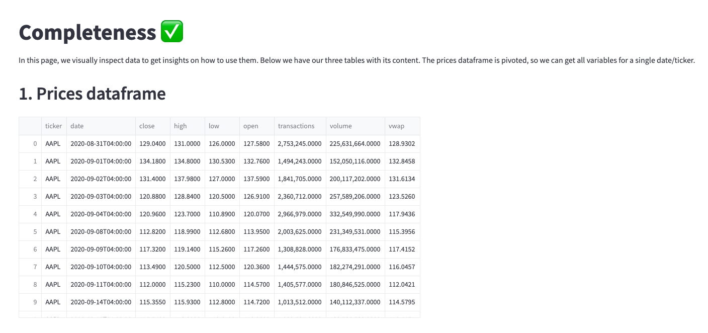
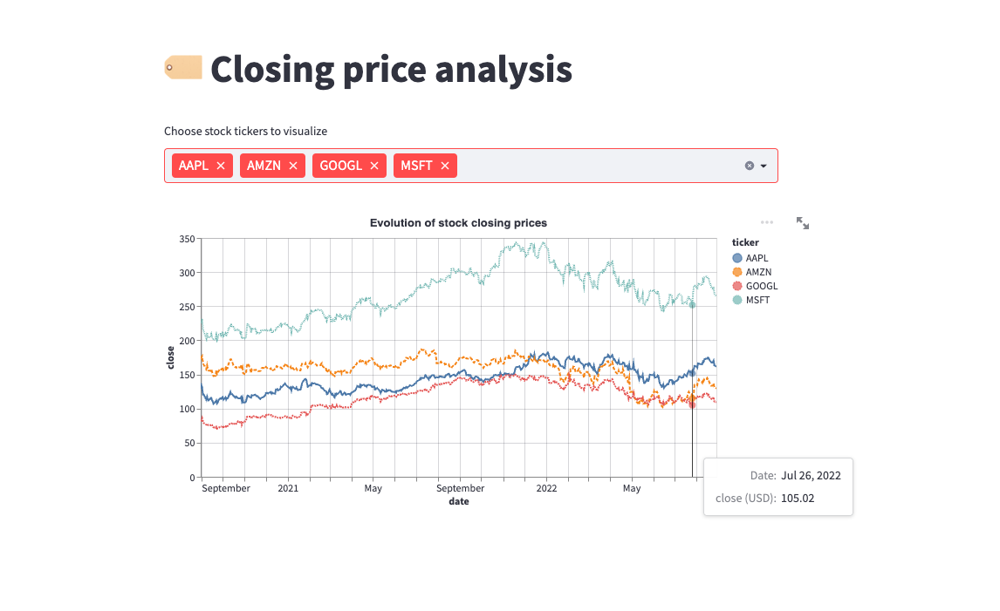

# Market data analysis 📈

In this app, we take a deep dive into common market analysis using Python data stack.
Data come from Polygon API, a free API which can provide asset prices for stocks, currencies,
options and crypto. 

## 1. Data Ingestion Framework

Data ingestion is made by a simple framework inspired on some common ETL transformations. It consists
of a bunch of connectors that extracts data from the web, transforms into a common tabular format and
loads it back into a relational database.

Connectors (extract and load) are supposed to be used as context managers. So, one can extract data from
the web by calling the script below.

```python
url = 'http://www.google.com'

with HTTPConnector() as session:
    extract = ExtractHTTP().run(url, session)
```

In this code, `HTTPConnector()` is capable to give the HTTP session by disabling SSL, setting proxy or specifying 
some common headers to the requests. In the other hand, `ExtractHTTP()` is intend to send the actual requests to
the server.

## 2. Market pipelines

We provided basically three pipelines to populate the database. All of them came from the Polygon API, as mentioned above.

- Exchangers pipeline: it is used to extract market exchange data such as code or location.
- Prices pipeline: it is used to gather for stock prices from the US market.
- Tickers pipeline: it is used to collect information about companies listed in the exchanges.


Because of limitations in the free license of Polygon API, we are allowed to make only five requests per minute. So, we
designed a simple 1-minute wait between each stock in `main.py` script.

## 3. Analysis

In the streamlit app, we provided some basic charts to interact with the data extracted from the APIs. It consists
of two pages:
- Completeness: a visual inspection on the database to look for missing values. Ideally, this is made in some automatic way; however, we are simplifying it a little bit. 
- Prices: an interactive chart for the closing price for stocks. 



